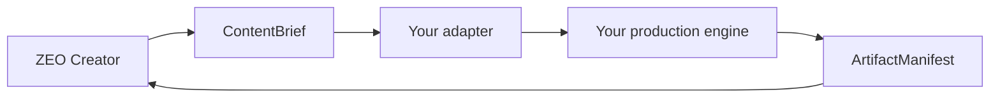

<div align="center">

# ZEO Creator

**The open protocol for continuous editorial and creator operations.**

Turn source observations into evolving stories, frozen dossiers, editorial agendas,
editions, production briefs, reviewed artifacts, commentary, newsletters and corrections.

[](https://github.com/profrodai/zeocreator/actions/workflows/ci.yml)
[](https://pypi.org/project/zeocreator/)
[](https://www.python.org/)
[](https://pypi.org/project/zeocore/)
[](https://github.com/profrodai/zeocreator/blob/v0.5.3/LICENSE)

[Documentation](https://profrodai.github.io/zeocreator/) · [Quickstart](https://profrodai.github.io/zeocreator/getting-started/installation/) · [Examples](https://github.com/profrodai/zeocreator/tree/v0.5.3/examples) · [API reference](https://profrodai.github.io/zeocreator/reference/contracts/)

</div>

---

ZEO Creator is an open-source, typed contract and transformation layer for newsrooms,
independent publications and creator teams. It supports live, daily, periodic and
evergreen work without storing newsroom memory, scheduling jobs, possessing
credentials or publishing behind an editor's back.

```mermaid
flowchart LR
    S[Source observations] --> G[Signals and story revisions]
    G --> D[Publication-scoped dossiers]
    D --> A[Agendas and editions]
    A --> B[Briefs, articles, commentary, newsletters]
    B --> X[External producers]
    X --> V[Artifact and editorial review]
    V --> O[Digest-bound proposals]
    O -. runtime approval .-> P[Provider execution]
    P --> M[Performance and corrections]
```



## Why ZEO Creator?

- **Evidence-backed.** Every material brief claim resolves to explicit provenance.
- **Continuous.** Stories evolve across live, daily, periodic, and evergreen windows.
- **Editorially coherent.** Dossiers, agendas, and editions prevent every producer from researching alone.
- **Integrity-aware.** Commentary, journalism, corrections, and qualified-human requirements fail closed.
- **Producer-neutral.** Public briefs express creative intent; adapters own production-specific lowering.
- **Publication-safe.** Organization and publication scope follow every durable artifact.
- **Approval-safe.** Artifact, payload, destination, or schedule changes invalidate approval.
- **Provider-neutral.** Canonical email operations accept supplied artifacts and never own provider credentials.
- **Runner-ready.** The same capabilities work in a bounded agent workflow or managed runtime.
- **Portable.** RFC 8785 digests and packaged JSON Schemas support Python, TypeScript, and Go consumers.

## Runtime integration candidate

The current 0.5.4 source candidate upgrades to Zeocore 0.11.0 and its shared
Runtime host. Use the [Runtime integration guide](docs/guides/runtime-host.md)
to build the candidate wheel, export its provider inventory, and prepare the
real portfolio request. Creator/Core conformance is separate from Runtime's
Go supervision and managed-agent acceptance. The PyPI instructions below
remain for the released 0.5.3 package.

## Install

Install the public `zeocreator` distribution on Python 3.14 or newer:

```console
uv add "zeocreator==0.5.3"
```

or:

```console
python -m pip install "zeocreator==0.5.3"
```

Zeocore 0.9.0 is installed automatically. The distribution is `zeocreator`, the
Python import is `zeo_creator`, and the CLI is `zeo-creator`. Earlier Git-only
installations used the distribution name `zeo-creator`; remove that distribution
before installing this release, or use a fresh virtual environment.

```console
zeo-creator doctor --json
python -m zeo_creator.examples.create_content_brief
python -m zeo_creator.examples.email_marketing
```

All examples run without provider credentials or network calls.

## First capability

Every capability publishes typed request and response schemas, effects,
requirements, examples, projections, and enumerated errors.

```python
from zeo_core.tools import invoke_sync

from zeo_creator.capabilities.create_content_brief import CreateContentBriefResponse
from zeo_creator.registry import capability_registry
from zeo_creator.runtime import make_context

capability = capability_registry().get("creator.create_content_brief@1.0.0")
request = capability.request_model.model_validate(capability.definition.examples[0].request)
result = invoke_sync(
    capability,
    request,
    make_context(capability_name="create_content_brief"),
)

if not isinstance(result.data, CreateContentBriefResponse):
    raise RuntimeError(result.human_message)

print(result.data.brief.content_kind)    # article
print(result.data.brief.content_digest)  # sha256:...
```

Run the packaged example after installation:

```console
python -m zeo_creator.examples.create_content_brief
```

In a uv-managed project, prefix Python and CLI commands with `uv run`.

## Capability families

| Family | Capabilities | Responsibility |
|---|---|---|
| Research and story | `research_synthesis`, `extract_editorial_signals`, `update_story_revisions`, `build_story_dossier` | Normalize evidence into evolving, frozen editorial knowledge |
| Agenda and production | `plan_editorial_agenda`, `plan_edition`, `plan_content_portfolio`, `create_content_brief` | Select publication work and express producer-neutral intent |
| Commentary | `identify_engagement_opportunities`, `compose_commentary`, `review_commentary` | Participate selectively with context, stance, expiry and human approval |
| Newsletters | `plan_newsletter_issue`, `compose_newsletter_issue`, `review_newsletter_issue` | Produce HTML/plain-text issues from editions and dossiers |
| Email marketing | `plan_email_campaign`, `finalize_email_campaign`, `propose_email_operation`, `plan_email_sequence`, `plan_email_message`, `compose_email_message`, `review_email_message`, `prepare_email_delivery`, `assess_email_program` | Design and evaluate exact email programs from supplied inputs |
| Journalism | `compose_news_article`, `review_news_article`, `prepare_correction` | Draft attributed reporting and represent corrections with risk gates |
| Delivery and learning | `validate_delivery`, `prepare_distribution`, `assess_performance` | Validate bytes and claims, propose effects, and interpret outcomes |

All 29 capability IDs are independently composable. There is intentionally no
monolithic workflow capability. Scheduling, retries,
approval state, persistence, provider execution, and reconciliation belong to
the controlling runtime.

## Producer contract

`ContentBrief` carries creator intent in a public envelope: content kind,
objective, audience, source document, evidence claims, brand references, target
channels, and declarative delivery requirements. Qualified content kinds are
extensible—`article`, `video.short`, `image.carousel`, or a private namespace.

A producer returns an `ArtifactManifest` containing one or more artifact
descriptors, byte-digest proofs, claim references, and typed attestations. ZEO
Creator validates the envelope and preserves opaque `ExtensionPayload` data but
does not interpret a producer's private schema.

## The editorial kernel

`SourceObservation` records what was retrieved and how complete it was.
`EditorialSignal` explains why it may matter. `StoryRevision` preserves a story's
verified facts, disputed claims, unknowns and status through time. `StoryDossier`
freezes that state for one publication, and `EditorialAgenda` plus `EditionPlan`
turn dossiers into coherent publication decisions.

One dossier can support a breaking update, a daily briefing, a video brief, a
social reply and a later newsletter section without silently sharing voice,
policy or approval across publications. See the
[continuous editorial model](https://profrodai.github.io/zeocreator/concepts/continuous-editorial-operations/).



## Export schemas

Schemas ship inside the wheel, so non-Python consumers do not need the source tree:

```console
zeo-creator contracts list --json
zeo-creator contract-schema --name=content-brief --version=1
zeo-creator contracts export --output=./schemas
```

Each catalog entry includes the schema's RFC 8785 canonical SHA-256 digest.
Package, capability, and contract versions evolve independently; the
[compatibility policy](https://profrodai.github.io/zeocreator/reference/contracts/#compatibility-and-version-axes)
defines when each one changes.

## The authority boundary

ZEO Creator proposes destination-specific operations; each binds an explicit
channel and destination, selected artifacts, content document, optional
accessibility text and extension, and schedule. It never executes them. A
runner resolves connection references, checks policy, obtains approval, mints
bounded effect authority, executes through an authorized connector, and retains
a secret-safe receipt.

## Reference workflow

Credential-free examples model two isolated publications and a caller-defined
portfolio containing articles, short video, image carousels, and newsletter
issues. The fixture proves research, planning, briefs, artifact bundles, reviews,
multi-channel proposals, and separate performance assessments without encoding
any private production taxonomy.

```console
python -m zeo_creator.examples.complete_content_portfolio
```

Explore [`reference/examples`](https://github.com/profrodai/zeocreator/tree/v0.5.3/reference/examples), follow the
[portfolio tutorial](https://profrodai.github.io/zeocreator/tutorials/content-portfolio/), or read the
[production adapter guide](https://profrodai.github.io/zeocreator/guides/production-adapters/).

## Development

```console
make setup       # install the locked environment
make verify      # lint, strict typing, tests, references, docs, package checks
make examples    # run every credential-free example
make docs-serve  # serve documentation locally
make doctor      # verify Python, Zeocore, manifests, and projections
```

The repository enforces architectural import boundaries and tests installed
wheel behavior. See [architecture](https://profrodai.github.io/zeocreator/concepts/architecture/),
[canonical digests](https://profrodai.github.io/zeocreator/concepts/canonical-digests/), and
[contributing](https://profrodai.github.io/zeocreator/contributing/).

## Status

Version 0.5.3 is the first PyPI release, with independently reviewed email v4
contracts and 135 portable receipt cases. This remains an early 0.x API: pin the
package and contract versions. Release publication does not establish live
HubSpot/Kit interoperability; execution and account qualification belong to the host.

MIT licensed.

## Email campaigns and sequences

[Email marketing](https://profrodai.github.io/zeocreator/guides/email-marketing/) adds immutable campaigns, linear
sequence revisions, dual-format messages, audience summaries and exact delivery
packages. Runtime and Newsroom collect observations before Creator invocation;
Zeocore and ZEOconnect own provider lowering and execution. Existing newsletter
v1 schemas and capabilities remain compatible.

Run `uv run python examples/email_marketing.py` for three isolated publications.
The example uses fake HubSpot-shaped and Kit-shaped hosts; it does not establish
live interoperability. The public Zeocore email operation contract is still a
dependency, and example operation IDs are explicitly simulated. The same example
is installed as `python -m zeo_creator.examples.email_marketing`.
