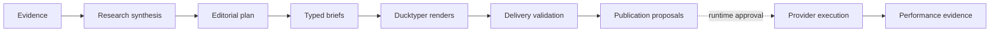

<div align="center">

# ZEO Creator

**Creator operations, governed by design.**

Research through injected connectors. Plan publication-correct portfolios.
Create typed Ducktyper briefs. Validate every render. Prepare distribution
without publishing behind your back.

[](https://github.com/profrodai/zeocreator/actions/workflows/ci.yml)
[](https://www.python.org/)
[](https://pypi.org/project/zeocore/)
[](LICENSE)

[Documentation](docs/index.md) · [Quickstart](docs/getting-started/first-capability.md) · [Examples](examples/README.md) · [Capability reference](docs/reference/capabilities.md)

</div>

---

ZEO Creator is a typed Python capability package for the work between raw
evidence and an authorized creator operation. It keeps creator-domain judgment
inside your application while Zeocore supplies capability contracts and your
runner supplies connectors, policy, approvals, and effect authority.



## Why ZEO Creator?

- **Publication-safe** — profiles, evidence, assignments, briefs, reviews, and
  proposals retain organization and publication scope end to end.
- **Evidence-backed** — every material brief claim resolves to explicit source
  provenance.
- **Renderer-neutral boundary** — Ducktyper receives a strict discriminated
  brief and returns a render manifest bound to its accepted revision and digest.
- **Approval-safe** — changing an artifact, payload, destination, or schedule
  changes the approval digest.
- **Provider-neutral** — creator logic asks injected ports for observations and
  emits proposals; it never imports provider SDKs or owns credentials.
- **Runner-ready** — the same six capabilities work under a bounded Sovereign
  workflow or a managed ZEO runtime.

## Install

ZEO Creator currently ships from its public Git repository while the Python
distribution remains pre-release.

With `uv`:

```console
uv add "zeo-creator @ git+https://github.com/profrodai/zeocreator.git"
```

Or with `pip`:

```console
python -m pip install "git+https://github.com/profrodai/zeocreator.git"
```

Requires Python 3.14+ and consumes exactly Zeocore 0.6.0.

## First capability

Every public operation is discoverable from one registry and carries its own
request schema, response schema, effects, requirements, examples, projections,
and error codes.

```python
from zeo_core.tools import invoke_sync

from zeo_creator.capabilities.create_ducktyper_brief import CreateDucktyperBriefResponse
from zeo_creator.registry import capability_registry
from zeo_creator.runtime import make_context

registry = capability_registry()
create_brief = registry.get("creator.create_ducktyper_brief@1.0.0")

# Capability examples are schema-valid executable fixtures.
request = create_brief.request_model.model_validate(
    create_brief.definition.examples[0].request
)
result = invoke_sync(
    create_brief,
    request,
    make_context(capability_name="create_ducktyper_brief"),
)

if not isinstance(result.data, CreateDucktyperBriefResponse):
    raise RuntimeError(result.human_message)
brief = result.data.brief
print(brief.deliverable_kind)  # animated_episode
print(brief.content_digest)    # sha256:...
```

Run the complete example:

```console
git clone https://github.com/profrodai/zeocreator.git
cd zeocreator
uv sync --frozen
uv run python examples/create_brief.py
```

## Six focused capabilities

| Capability | What it owns | External effect |
|---|---|---|
| `creator.research_synthesis@1.0.0` | Retrieve permitted observations and synthesize one publication | Read only |
| `creator.plan_daily_portfolio@1.0.0` | Select a balanced, non-duplicative portfolio | None |
| `creator.create_ducktyper_brief@1.0.0` | Convert one assignment into one typed renderer brief | None |
| `creator.validate_delivery@1.0.0` | Check render identity, claims, brand, and technical coverage | None |
| `creator.prepare_distribution@1.0.0` | Produce digest-bound publication proposals | None |
| `creator.assess_performance@1.0.0` | Retrieve metrics and assess one publication | Read only |

There is intentionally no `run_daily` capability. Scheduling, retry, approval
waits, persistence, authorization, provider execution, and reconciliation belong
to the controlling runtime.

## The authority boundary

ZEO Creator can prepare this:

```python
ProposedPublicationOperation(
    artifact_ref="artifact_…",
    provider_kind="linkedin",
    connection_ref="connection_…",
    destination_account_ref="destination_…",
    approval_digest="sha256:…",
    idempotency_key="publish_…",
    # ...
)
```

It cannot authorize or execute it. A runner must resolve the connection, check
policy, mint exact effect authority, execute through Zeocore or ZEOconnect, and
retain a secret-safe receipt.

## Dogfood proof

The committed credential-free fixture runs the primary daily workflow for two
fully isolated properties:

| Publication | Animated episode | HUD | Comic slides |
|---|:---:|:---:|:---:|
| `profrod.ai` | 1 | 1 | 1 |
| `zeroemployee.org` | 1 | 1 | 1 |

That produces **2 research syntheses → 6 assignments → 6 briefs → 6 render
validations → 12 example channel proposals → 2 performance assessments**.

Inspect the [six briefs](reference/dogfood/ducktyper-briefs.json), run the
[complete portfolio example](examples/complete_daily_portfolio.py), or read the
[daily-loop tutorial](docs/tutorials/daily-portfolio.md).

## Explore

```console
zeo-creator capabilities
zeo-creator capabilities --json
zeo-creator capabilities --projection openai
zeo-creator doctor --json
```

## Development

```console
make setup       # exact locked environment
make verify      # lint + strict typing + tests + references + docs
make examples    # run every public example
make docs-serve  # local documentation with live reload
```

The architecture prevents creator-domain modules from importing provider SDKs,
runtime products, or ambient credential access. See the [architecture guide](docs/concepts/architecture.md),
[Zeocore boundary ADR](docs/adr/0001-zeocore-version-and-runtime-boundary.md),
and [contributing guide](docs/contributing.md).

## Status

The repository and capability contracts are ready for dogfooding. PyPI
publication and live provider effects require separate operator approval and
have not occurred.

MIT licensed.
