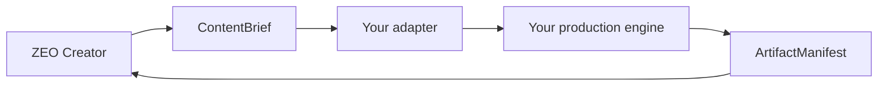

<div align="center">

# ZEO Creator

**Typed creator operations, governed by design.**

Turn evidence into content portfolios and production-ready creative briefs.
Validate produced artifacts. Prepare distribution without publishing behind your back.

[](https://github.com/profrodai/zeocreator/actions/workflows/ci.yml)
[](https://www.python.org/)
[](https://pypi.org/project/zeocore/)
[](LICENSE)

[Documentation](docs/index.md) · [Quickstart](docs/getting-started/first-capability.md) · [Examples](examples/README.md) · [API reference](docs/reference/contracts.md)

</div>

---

ZEO Creator is an open-source, typed creator-operations capability package. It
turns evidence into governed content portfolios and producer-neutral creative
briefs, validates artifact bundles, prepares distribution, and learns from
performance. Any production engine can integrate through versioned JSON contracts.

```mermaid
flowchart LR
    E[Evidence] --> R[Research synthesis]
    R --> P[Content portfolio]
    P --> B[Content briefs]
    B --> X[External producer]
    X --> A[Artifact bundles]
    A --> V[Delivery review]
    V --> O[Publication proposals]
    O -. runtime approval .-> D[Distribution]
    D --> M[Performance evidence]
```



## Why ZEO Creator?

- **Evidence-backed.** Every material brief claim resolves to explicit provenance.
- **Producer-neutral.** Public briefs express creative intent; adapters own production-specific lowering.
- **Publication-safe.** Organization and publication scope follow every durable artifact.
- **Approval-safe.** Artifact, payload, destination, or schedule changes invalidate approval.
- **Provider-neutral.** Creator code uses injected ports and never owns provider credentials.
- **Runner-ready.** The same capabilities work in a bounded agent workflow or managed runtime.
- **Portable.** RFC 8785 digests and packaged JSON Schemas support Python, TypeScript, and Go consumers.

## Install

The distribution is currently pre-release and installs from Git:

```console
uv add "zeo-creator @ git+https://github.com/profrodai/zeocreator.git"
```

or:

```console
python -m pip install "git+https://github.com/profrodai/zeocreator.git"
```

ZEO Creator requires Python 3.14+ and Zeocore 0.6.0.

## First capability

Every capability publishes typed request and response schemas, effects,
requirements, examples, projections, and enumerated errors.

```python
from zeo_core.tools import invoke_sync

from zeo_creator.capabilities.create_content_brief import CreateContentBriefResponse
from zeo_creator.registry import capability_registry
from zeo_creator.runtime import make_context

capability = capability_registry().get("creator.create_content_brief@1.0.0")
request = capability.request_model.model_validate(capability.definition.examples[0].request)
result = invoke_sync(
    capability,
    request,
    make_context(capability_name="create_content_brief"),
)

if not isinstance(result.data, CreateContentBriefResponse):
    raise RuntimeError(result.human_message)

print(result.data.brief.content_kind)    # article
print(result.data.brief.content_digest)  # sha256:...
```

Run it locally:

```console
git clone https://github.com/profrodai/zeocreator.git
cd zeocreator
uv sync --frozen
uv run python examples/create_content_brief.py
```

## Six focused capabilities

| Capability | Responsibility | Effect |
|---|---|---|
| `creator.research_synthesis@1.0.0` | Retrieve permitted observations and synthesize one publication | Read only |
| `creator.plan_content_portfolio@1.0.0` | Plan a scoped window using caller-supplied content kinds and quantities | None |
| `creator.create_content_brief@1.0.0` | Convert one assignment into a generic creative brief | None |
| `creator.validate_delivery@1.0.0` | Check artifact integrity, evidence, brand, and declared attestations | None |
| `creator.prepare_distribution@1.0.0` | Produce digest-bound publication proposals | None |
| `creator.assess_performance@1.0.0` | Retrieve metrics and assess one publication | Read only |

There is intentionally no monolithic workflow capability. Scheduling, retries,
approval state, persistence, provider execution, and reconciliation belong to
the controlling runtime.

## Producer contract

`ContentBrief` carries creator intent in a public envelope: content kind,
objective, audience, source document, evidence claims, brand references, target
channels, and declarative delivery requirements. Qualified content kinds are
extensible—`article`, `video.short`, `image.carousel`, or a private namespace.

A producer returns an `ArtifactManifest` containing one or more artifact
descriptors, byte-digest proofs, claim references, and typed attestations. ZEO
Creator validates the envelope and preserves opaque `ExtensionPayload` data but
does not interpret a producer's private schema.



## Export schemas

Schemas ship inside the wheel, so non-Python consumers do not need the source tree:

```console
zeo-creator contracts list --json
zeo-creator contract-schema --name=content-brief --version=1
zeo-creator contracts export --output=./schemas
```

Each catalog entry includes the schema's RFC 8785 canonical SHA-256 digest.
Package, capability, and contract versions evolve independently; the
[compatibility policy](docs/reference/contracts.md#compatibility-and-version-axes)
defines when each one changes.

## The authority boundary

ZEO Creator proposes destination-specific operations; each binds an explicit
channel and destination, selected artifacts, content document, optional
accessibility text and extension, and schedule. It never executes them. A
runner resolves connection references, checks policy, obtains approval, mints
bounded effect authority, executes through an authorized connector, and retains
a secret-safe receipt.

## Reference workflow

Credential-free examples model two isolated publications and a caller-defined
portfolio containing articles, short video, image carousels, and newsletter
issues. The fixture proves research, planning, briefs, artifact bundles, reviews,
multi-channel proposals, and separate performance assessments without encoding
any private production taxonomy.

```console
uv run python examples/complete_content_portfolio.py
```

Explore [`reference/examples`](reference/examples), follow the
[portfolio tutorial](docs/tutorials/content-portfolio.md), or read the
[production adapter guide](docs/guides/production-adapters.md).

## Development

```console
make setup       # install the locked environment
make verify      # lint, strict typing, tests, references, docs, package checks
make examples    # run every credential-free example
make docs-serve  # serve documentation locally
make doctor      # verify Python, Zeocore, manifests, and projections
```

The repository enforces architectural import boundaries and tests installed
wheel behavior. See [architecture](docs/concepts/architecture.md),
[canonical digests](docs/concepts/canonical-digests.md), and
[contributing](docs/contributing.md).

## Status

ZEO Creator is a pre-release contract and reference package. PyPI publication
and live provider effects require separate operator approval and have not occurred.

MIT licensed.
