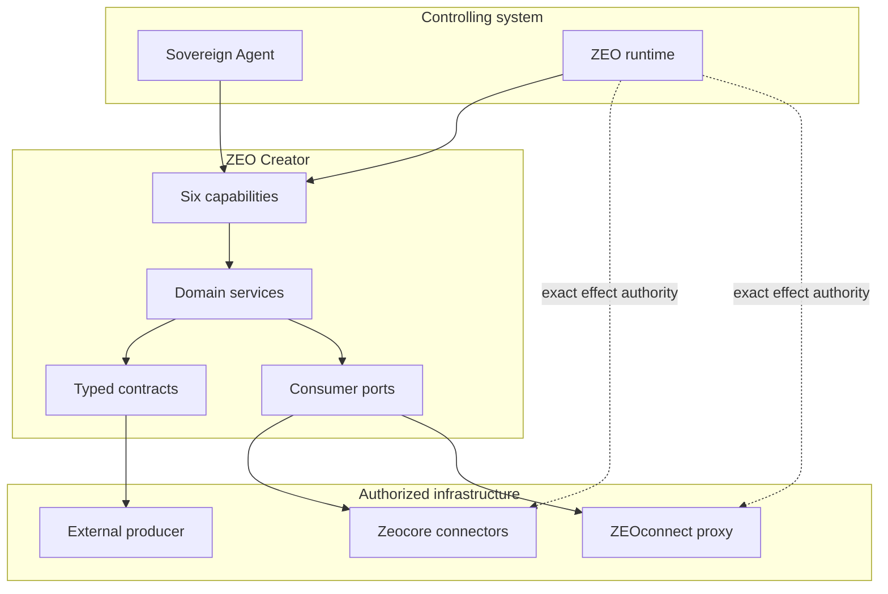

# Architecture

ZEO Creator is creator-specific business logic over Zeocore capabilities and
runner-injected connector ports. The dependency direction is intentional.

## Ownership matrix

| Component | Owns | Must not own |
|---|---|---|
| ZEO Creator | Synthesis, editorial planning, briefs, validation, proposals, assessment | Credentials, OAuth, scheduling, rendering, billing, provider writes |
| Zeocore | Capability contracts, effects, manifests, invocation, connectors | Editorial policy and portfolio decisions |
| Sovereign Agent | Bounded builder-facing execution | Managed organizational operations |
| ZEO runtime | Commitments, schedules, policy, approvals, authority, retries, receipts | Creator-domain transformations |
| ZEOconnect | Managed OAuth and provider execution | Editorial judgment |
| External producer | Content production and artifact manifests | Research, selection, publishing authority |

## Read dependency direction

1. The runner constructs the request and `ToolContext`.
2. The context contains an authorized provider-neutral port implementation.
3. ZEO Creator requests observations using safe connection references.
4. The adapter talks to a Zeocore connector or ZEOconnect proxy.
5. ZEO Creator validates provenance and produces a durable artifact.

## Write dependency direction

1. ZEO Creator validates an artifact bundle and prepares publication proposals.
2. A human approves an exact digest.
3. The runtime checks policy and mints bounded effect authority.
4. An authorized connector executes the provider operation.
5. The runtime retains the secret-safe receipt and reconciles the outcome.

At no point does a reusable credential enter a capability model, brief, log,
manifest, artifact, proposal, or receipt.

## Enforced boundaries

The test suite parses imports in `capabilities`, `contracts`, and `services` and
rejects provider SDKs or runtime product modules. It also searches creator source
for ambient credential access and direct provider endpoints.

The ports are deliberately narrow protocols. They are consumer interfaces, not a
second connector SDK.
