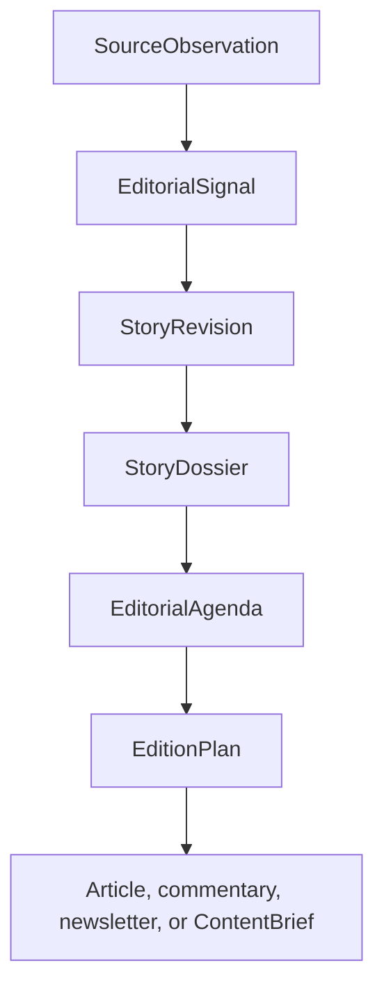

# Continuous editorial operations

ZEO Creator models an editorial cycle as a caller-supplied time window—not a week,
a day, or a scheduler. A runtime can compose the same contracts for a breaking
update, daily desk meeting, periodic edition, or evergreen explainer.

## Observation is not verification

An observation says what a source made available, when it was retrieved, how it
was extracted and whether the capture is complete. Popularity, repetition and a
social post are observations—not verified facts. Claims become verified only in
an immutable story revision under the publication's evidence policy.

## Stories evolve; dossiers freeze

`StoryRevision` represents change through time. Its previous-revision link,
verified and disputed claims, developments, unknowns, freshness and risk survive
across collection windows. `StoryDossier` freezes one revision for one publication.
This gives downstream producers a stable research package and prevents a later
story update from silently changing approved work.

## Agendas choose; editions arrange

An `EditorialAgenda` records leads, secondary stories, watch items, rejections,
deferrals, follow-ups, gaps and concrete `PublicationSlot` demand for one desk.
An `EditionPlan` arranges those slots into a coherent surface with prominence,
publication window, update policy, correction state and human-editor requirements.

The distinction matters: the agenda explains editorial judgment; the edition
describes what readers encounter.

## Strategy and state boundaries

Judgment-bearing capabilities accept runner-injected strategies. The package ships
conservative deterministic strategies for tests and conformance. A private newsroom
can inject model-backed or human-supported implementations and persist story memory,
source reliability, persona positions and editor corrections.

ZEO Creator itself remains stateless. It does not collect continuously, schedule
work, store a graph, decide legal qualifications, mint effect authority or execute
publication.
