# Creator operations, governed by design

ZEO Creator turns evidence into governed content portfolios and producer-neutral
creative briefs, validates artifact bundles, prepares distribution, and learns
from performance.

[Get started](getting-started/index.md){ .md-button .md-button--primary }
[Explore the contracts](reference/contracts.md){ .md-button }

---

## One coherent path from evidence to learning

```mermaid
flowchart LR
    A[Connector observations] --> B[Research synthesis]
    B --> C[Content portfolio]
    C --> D[Content briefs]
    D --> E[External producer]
    E --> F[Artifact bundles]
    F --> G[Delivery reviews]
    G --> H[Distribution proposals]
    H -. exact runtime authority .-> I[Provider receipts]
    I --> J[Performance assessment]
```

ZEO Creator owns the creator-domain transformations. The controlling runtime
owns the authority boundary; a production adapter owns producer-specific lowering.

-   :material-file-tree:{ .lg .middle } **Typed end to end**

    ---

    Strict Pydantic contracts reject stale digests, mixed publication scope, and
    credential-shaped fields before downstream work begins.

    [Understand contracts](concepts/contracts.md)

-   :material-puzzle:{ .lg .middle } **Bring any producer**

    ---

    Content briefs express intent. Generic manifests describe artifact bundles.
    Opaque extensions let private adapters evolve without leaking their schemas.

    [Build a production adapter](guides/production-adapters.md)

-   :material-shield-check:{ .lg .middle } **Approve exact content**

    ---

    Reviews bind artifacts, payloads, destinations, and schedules into one
    deterministic digest. Governed changes require fresh approval.

    [Validate delivery](guides/delivery-distribution.md)

-   :material-connection:{ .lg .middle } **Inject connectors**

    ---

    Supply local Zeocore connectors or managed proxies. Creator models receive
    observations and safe references—never reusable credentials.

    [Inject a connector](guides/connectors.md)

## Six focused capabilities

| Stage | Capability | Result |
|---|---|---|
| Research | `creator.research_synthesis@1.0.0` | One publication-scoped synthesis |
| Plan | `creator.plan_content_portfolio@1.0.0` | A planning-window portfolio |
| Brief | `creator.create_content_brief@1.0.0` | One producer-neutral content brief |
| Review | `creator.validate_delivery@1.0.0` | One digest-bound delivery review |
| Distribute | `creator.prepare_distribution@1.0.0` | Proposals only; no provider write |
| Learn | `creator.assess_performance@1.0.0` | One publication performance assessment |

## Designed boundaries

ZEO Creator owns synthesis, editorial planning, brief construction, validation,
distribution proposals, and performance interpretation. It does not own
credentials, OAuth, scheduling, workflow state, rendering, billing, approval
authority, or provider execution.

[Follow the complete portfolio tutorial](tutorials/content-portfolio.md){ .md-button .md-button--primary }
