# Creator operations, governed by design

ZEO Creator turns evidence into publication-ready creator operations while
keeping credentials, approvals, schedules, and provider authority where they
belong: in your runner.

[Get started](getting-started/index.md){ .md-button .md-button--primary }
[Explore the capabilities](reference/capabilities.md){ .md-button }

---

## One coherent path from evidence to learning

```mermaid
flowchart LR
    A[Connector observations] --> B[Research synthesis]
    B --> C[Daily portfolio]
    C --> D[Ducktyper briefs]
    D --> E[Rendered artifacts]
    E --> F[Delivery reviews]
    F --> G[Distribution proposals]
    G -. exact runtime authority .-> H[Provider receipts]
    H --> I[Performance assessment]
```

ZEO Creator owns the solid creator-domain transformations. Your controlling
runtime owns the dotted authority boundary.

-   :material-file-tree:{ .lg .middle } **Typed from end to end**

    ---

    Pydantic contracts reject invalid formats, stale digests, mixed publication
    scope, and credential-shaped fields before downstream work begins.

    [Understand the contracts](concepts/contracts.md)

-   :material-shield-check:{ .lg .middle } **Approval means exactly this**

    ---

    Reviews bind the brief, render, payload, destination, and schedule into one
    deterministic digest. Any governed change requires a new approval.

    [Validate and prepare distribution](guides/delivery-distribution.md)

-   :material-connection:{ .lg .middle } **Bring your own connectors**

    ---

    Inject local Zeocore connectors or ZEOconnect-backed proxies. Creator code
    receives observations and connection references—never reusable credentials.

    [Inject a connector](guides/connectors.md)

-   :material-robot-outline:{ .lg .middle } **Use any controlling runner**

    ---

    Invoke the same stable capability IDs from Sovereign Agent or a managed ZEO
    runtime. Composition is intentionally outside the package.

    [Integrate a runner](guides/runner-integration.md)

## The six-capability surface

| Stage | Capability | Result |
|---|---|---|
| Research | `creator.research_synthesis@1.0.0` | One publication-scoped synthesis |
| Plan | `creator.plan_daily_portfolio@1.0.0` | A balanced daily editorial plan |
| Brief | `creator.create_ducktyper_brief@1.0.0` | One discriminated Ducktyper brief |
| Review | `creator.validate_delivery@1.0.0` | One digest-bound delivery review |
| Distribute | `creator.prepare_distribution@1.0.0` | Provider-neutral proposals, no writes |
| Learn | `creator.assess_performance@1.0.0` | One publication performance assessment |

!!! tip "Start with one capability"

    You do not need a scheduler or a full ZEO runtime to learn the model. The
    [first-capability guide](getting-started/first-capability.md) produces a typed
    Ducktyper brief locally in a few minutes.

## Designed boundaries

ZEO Creator owns: synthesis, editorial
selection, brief construction, delivery validation, distribution proposals, and
performance interpretation.

ZEO Creator does not own: credentials, OAuth,
scheduling, workflow persistence, approval state, provider execution, billing,
or media rendering.

This is a capability package, not a second connector framework and not a hidden
agent runtime.

## Proven with a real daily shape

The dogfood fixture plans one animated episode, one HUD, and one comic-slides
deliverable for each of `profrod.ai` and `zeroemployee.org`—six distinct briefs
with isolated profiles, histories, objectives, evidence, and approval scopes.

[Follow the complete tutorial](tutorials/daily-portfolio.md){ .md-button .md-button--primary }
