# Continuous editorial operations, governed by design

ZEO Creator turns observations into evolving stories, frozen dossiers, agendas,
editions, governed content and producer-neutral delivery contracts.

[Get started](getting-started/index.md){ .md-button .md-button--primary }
[Explore the contracts](reference/contracts.md){ .md-button }

---

## One coherent path from observation to accountable publication

```mermaid
flowchart LR
    A[Source observations] --> B[Signals]
    B --> C[Story revisions]
    C --> D[Publication dossiers]
    D --> E[Agendas and editions]
    E --> F[Articles, commentary, newsletters, briefs]
    F --> G[Review and artifact validation]
    G --> H[Distribution proposals]
    H -. exact runtime authority .-> I[Provider receipts]
    I --> J[Performance and corrections]
```

ZEO Creator owns the creator-domain transformations. The controlling runtime
owns the authority boundary; a production adapter owns producer-specific lowering.

-   :material-file-tree:{ .lg .middle } **Typed end to end**

    ---

    Strict Pydantic contracts reject stale digests, mixed publication scope, and
    credential-shaped fields before downstream work begins.

    [Understand contracts](concepts/contracts.md)

-   :material-puzzle:{ .lg .middle } **Bring any producer**

    ---

    Content briefs express intent. Generic manifests describe artifact bundles.
    Opaque extensions let private adapters evolve without leaking their schemas.

    [Build a production adapter](guides/production-adapters.md)

-   :material-shield-check:{ .lg .middle } **Approve exact content**

    ---

    Reviews bind artifacts, payloads, destinations, and schedules into one
    deterministic digest. Governed changes require fresh approval.

    [Validate delivery](guides/delivery-distribution.md)

-   :material-connection:{ .lg .middle } **Inject connectors**

    ---

    Supply local Zeocore connectors or managed proxies. Creator models receive
    observations and safe references—never reusable credentials.

    [Inject a connector](guides/connectors.md)

## Composable capability families

| Stage | Capability family | Result |
|---|---|---|
| Observe | Research synthesis and signal extraction | Publication-scoped evidence and developments |
| Remember | Story revision and dossier construction | Evolving truth plus frozen editorial packages |
| Decide | Agenda, edition, and portfolio planning | Explicit selections, rejections, slots and prominence |
| Create | Brief, commentary, newsletter and article composition | Producer/provider-neutral drafts |
| Review | Commentary, newsletter, journalism and artifact checks | Digest-bound, fail-closed review records |
| Distribute and learn | Publication proposals and performance assessment | No provider write; separate publication learning |

## Designed boundaries

ZEO Creator owns editorial contracts and stateless transformations. It does not own
credentials, OAuth, scheduling, workflow state, rendering, billing, approval
authority, or provider execution.

[Follow the complete portfolio tutorial](tutorials/content-portfolio.md){ .md-button .md-button--primary }
