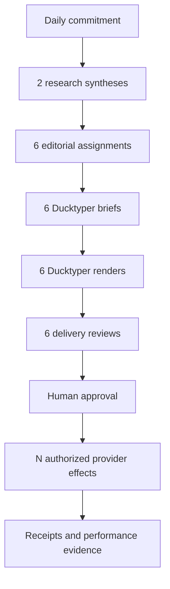

# Tutorial: the daily creator loop

This tutorial follows the reference workflow used to dogfood ZEO Creator. The
goal is not to create a scheduler. The goal is to understand the durable artifact
passed between six independently invocable capabilities.

## The target portfolio

| Publication | Animated episode | HUD | Comic slides |
|---|:---:|:---:|:---:|
| `profrod.ai` | 1 | 1 | 1 |
| `zeroemployee.org` | 1 | 1 | 1 |

The six renders can fan out to any approved number of channels. Six deliverables
does **not** mean six publication operations.



## 1. Research each publication separately

Invoke `creator.research_synthesis@1.0.0` once per publication. The runner injects
an evidence source and the request names authorized connection references.

```python
result = invoke_sync(
    research,
    request_for_profrod,
    make_context(
        capability_name="research_synthesis",
        services={"creator.evidence_source": evidence_source},
    ),
)
profrod_synthesis = result.data.synthesis
```

Repeat with a different profile, query set, content history, and connector scope
for `zeroemployee.org`. Never blend the evidence first and split it later.

!!! danger "A release-blocking mistake"

    Do not reuse one publication's `EvidenceItem`, `ResearchSynthesis`, profile
    reference, connection reference, or history entry for the other publication.
    ZEO Creator validates the scope and fails closed.

## 2. Plan the portfolio

Pass both publication profiles, both syntheses, recent content history, and one
objective per publication to `creator.plan_daily_portfolio@1.0.0`.

The dogfood constraints require three unique formats per publication:

```python
PortfolioConstraints(
    required_kinds=(
        DeliverableKind.ANIMATED_EPISODE,
        DeliverableKind.HUD,
        DeliverableKind.COMIC_SLIDES,
    ),
    assignments_per_publication=3,
    avoid_recent_topics=True,
)
```

The planner rejects duplicate publication inputs, avoids recent topics, explains
novelty, and binds each assignment to its publication profile.

## 3. Create six Ducktyper briefs

Fan out the plan assignments. Each invocation consumes one assignment, the
matching profile, and the matching synthesis:

```python
for assignment in plan.assignments:
    response = invoke_sync(
        create_brief,
        CreateDucktyperBriefRequest(
            assignment=assignment,
            publication=profiles[assignment.publication_id],
            synthesis=syntheses[assignment.publication_id],
            created_at=now,
        ),
        context,
    )
    briefs.append(response.data.brief)
```

The `format_payload` is a discriminated union. An animated payload cannot enter a
HUD brief, and a comic payload cannot omit its declared panels.

## 4. Let Ducktyper render

ZEO Creator stops at the typed brief boundary. Ducktyper returns:

- a `RenderedArtifact` containing the artifact identity and digest; and
- a `RenderManifest` describing the accepted brief revision/digest, included
  elements, rendered claims, brand profile, and technical checks.

ZEO Creator never fabricates these outputs on Ducktyper's behalf.

## 5. Validate before approval

`creator.validate_delivery@1.0.0` checks:

- brief, render, manifest, organization, and publication identity;
- canonical digests and content revision;
- format-required scene, panel, or HUD elements;
- every rendered factual claim against accepted evidence;
- brand profile and prohibited claims;
- technical delivery checks; and
- proposed destinations against the brief's target channels.

The resulting approval digest covers the brief, artifact, manifest, payload,
destination plan, and schedule.

## 6. Prepare distribution

After a human accepts the review, invoke
`creator.prepare_distribution@1.0.0`. The result is a tuple of
`ProposedPublicationOperation` objects—not provider calls.

```python
assert all(operation.approval_digest == review.approval_digest for operation in operations)
assert len({operation.idempotency_key for operation in operations}) == len(operations)
```

Changing the destination or schedule after review makes the approval stale.

## 7. Assess each publication

Once an authorized runtime has executed proposals elsewhere and retained
receipts, invoke `creator.assess_performance@1.0.0` separately for each
publication. The assessment records provenance, confidence, gaps, learnings, and
hypotheses. It proposes follow-up work but creates no future commitment.

## Run the reference proof

```console
uv run python examples/complete_daily_portfolio.py
```

Expected shape:

```json
{
  "assignments": 6,
  "briefs_by_publication": {
    "profrod.ai": 3,
    "zeroemployee.org": 3
  },
  "approved_renders": 6,
  "publication_proposals": 12,
  "executed_operations": 0,
  "assessments": ["profrod.ai", "zeroemployee.org"]
}
```

The full synthetic artifacts live in the public
[`reference/dogfood`](https://github.com/profrodai/zeocreator/tree/main/reference/dogfood)
directory.
