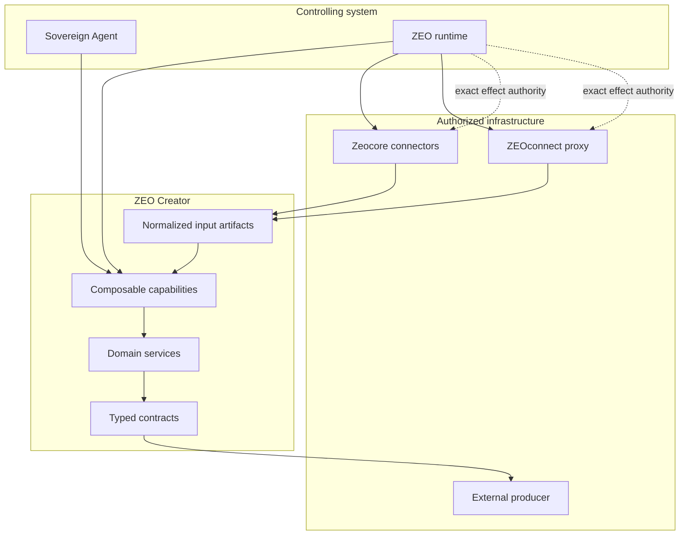

# Architecture

ZEO Creator is creator-specific business logic over Zeocore capabilities and
input-only editorial transformations. Runtime acquires observations before invocation.

## Ownership matrix

| Component | Owns | Must not own |
|---|---|---|
| ZEO Creator | Synthesis, editorial planning, briefs, validation, proposals, assessment | Credentials, OAuth, scheduling, rendering, billing, provider writes |
| Zeocore | Capability contracts, effects, manifests, invocation, connectors | Editorial policy and portfolio decisions |
| Sovereign Agent | Bounded builder-facing execution | Managed organizational operations |
| ZEO runtime | Commitments, schedules, policy, approvals, authority, retries, receipts | Creator-domain transformations |
| ZEOconnect | Managed OAuth and provider execution | Editorial judgment |
| External producer | Content production and artifact manifests | Research, selection, publishing authority |

## Read dependency direction

1. Runtime retrieves observations through Zeocore/ZEOconnect.
2. Newsroom persists normalized evidence, aggregate metrics and retrieval receipts.
3. Runtime constructs input-only Creator requests with scoped, digest-bound artifacts.
4. Creator validates provenance and transforms the supplied inputs.
5. Runtime persists the resulting plans, reviews and assessments.

The original `research_synthesis@1.0.0` and `assess_performance@1.0.0`
port-backed interfaces remain legacy compatibility paths. Supply already collected
in-memory data when using those paths; canonical email capabilities have no
acquisition service or network requirement.

## Write dependency direction

1. ZEO Creator validates an artifact bundle and prepares publication proposals.
2. A human approves an exact digest.
3. The runtime checks policy and mints bounded effect authority.
4. An authorized connector executes the provider operation.
5. The runtime retains the secret-safe receipt and reconciles the outcome.

At no point does a reusable credential enter a capability model, brief, log,
manifest, artifact, proposal, or receipt.

## Enforced boundaries

The test suite parses imports in `capabilities`, `contracts`, and `services` and
rejects provider SDKs or runtime product modules. It also searches creator source
for ambient credential access and direct provider endpoints.

The ports are deliberately narrow protocols. They are consumer interfaces, not a
second connector SDK.

## Email authority

Creator designs campaigns and sequence revisions and prepares immutable delivery
material. Zeocore owns public effect-operation types and lowering; ZEOconnect owns
account resolution, idempotency and provider execution; Runtime owns exact approval,
audience authorization and schedules. Newsroom owns durable history. See the
[email guide](../guides/email-marketing.md) for the current integration dependency.
